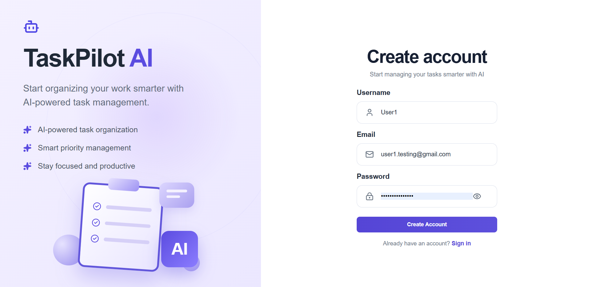
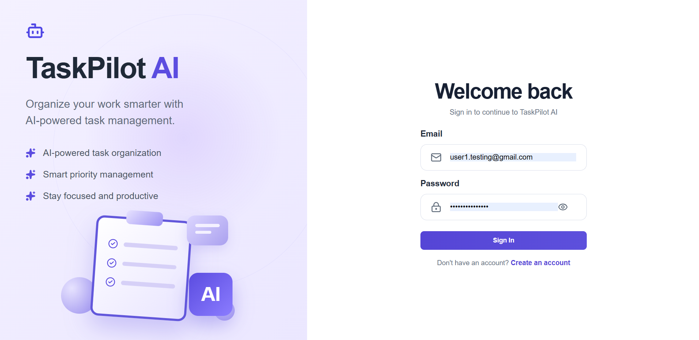
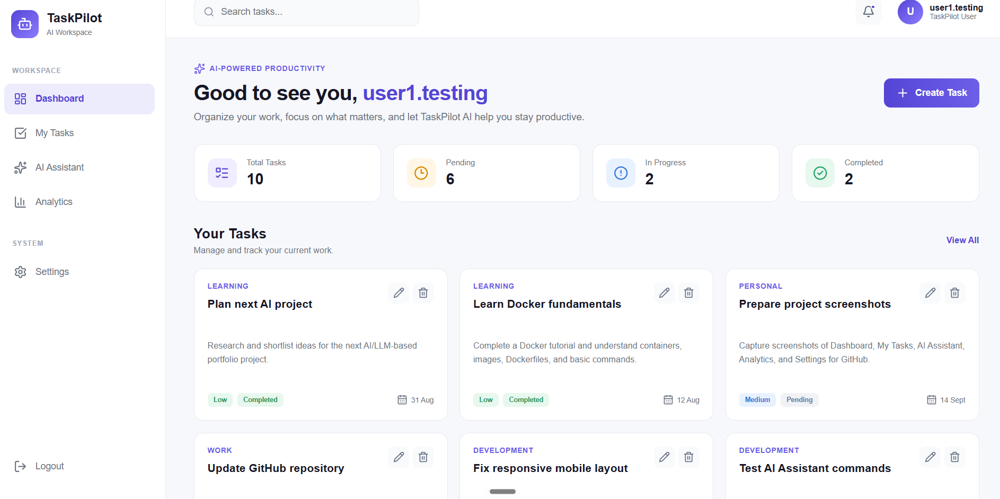
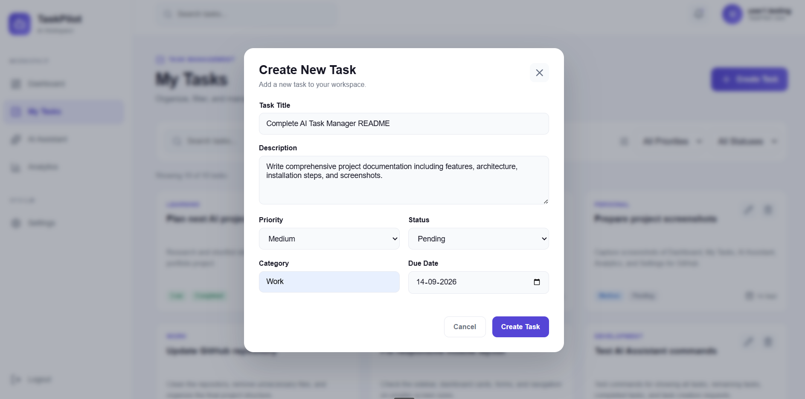
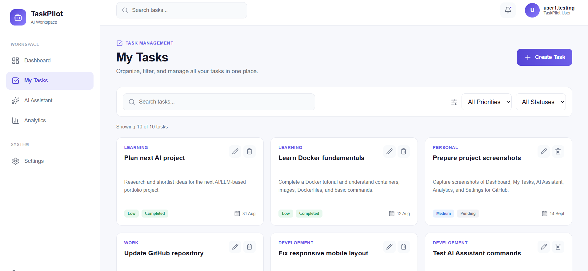
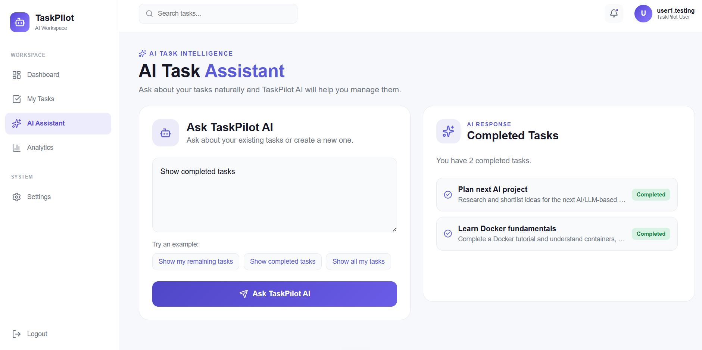
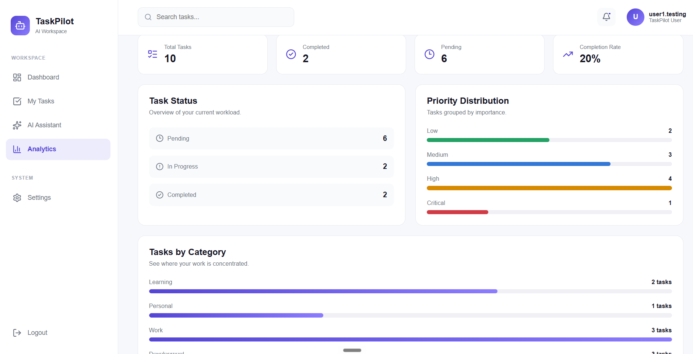
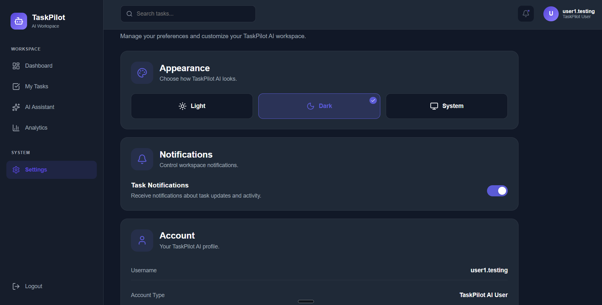

# 🚀 TaskPilot AI

### AI-Powered Task Management & Productivity Platform

TaskPilot AI is a full-stack task management platform built to provide a structured workspace for organizing, prioritizing, and managing tasks efficiently.

The project combines a modern React frontend with a FastAPI backend, secure authentication, database-driven task management, analytics capabilities, and an AI integration layer designed for intelligent task-related interactions.

Rather than being just a simple to-do application, TaskPilot AI demonstrates how a modern productivity platform can be structured using a scalable full-stack architecture with clear separation between the frontend, backend, authentication, business logic, database layer, and AI capabilities.

---

## ✨ Key Highlights

- ⚛️ Modern React + Vite frontend
- 🚀 High-performance FastAPI backend
- 🔐 JWT-based authentication and protected routes
- 📋 Complete task management functionality
- 🗄️ SQLAlchemy ORM with SQLite database
- 📊 Dashboard and task analytics
- 🤖 AI assistant integration architecture
- 🔄 RESTful frontend-backend communication
- 🎨 Responsive and customizable user interface
- 🏗️ Modular full-stack application architecture

---

# 🎯 Project Overview

Managing tasks effectively requires more than simply creating a list of items. A productivity application should provide users with a structured way to organize tasks, track priorities, monitor progress, and interact with their workspace efficiently.

TaskPilot AI was designed around this idea.

The platform provides a centralized environment where users can manage their tasks while the application's architecture supports authentication, persistent data storage, analytics, and future AI-powered productivity features.

The project focuses on demonstrating practical full-stack development concepts, including:

- Frontend and backend architecture
- REST API development
- Authentication and authorization
- Database modeling
- Protected application routes
- Task lifecycle management
- API integration
- AI integration architecture

---

# ✨ Features

## 📋 Task Management

TaskPilot AI provides a centralized workspace for managing tasks throughout their lifecycle.

Users can:

- Create new tasks
- Update existing tasks
- Delete tasks
- Add task descriptions
- Organize tasks using categories
- Assign task priorities
- Track task status
- Set due dates
- Manage tasks from a centralized workspace

---

## 📊 Dashboard

The dashboard provides users with an overview of their task activity and productivity.

Key insights include:

- Task statistics
- Task activity overview
- Priority-based insights
- Status tracking
- Productivity overview

The dashboard is designed to give users a quick understanding of their current workload.

---

## 📈 Analytics

The analytics section helps users understand their task data through structured productivity insights.

The application can provide insights into:

- Task distribution
- Priority analysis
- Status analysis
- Category-based insights
- Productivity tracking

This layer demonstrates how application data can be transformed into meaningful productivity information.

---

## 🤖 AI Assistant

TaskPilot AI includes an AI integration layer designed to support intelligent task-related interactions.

The AI architecture can support functionality such as:

- Task-related assistance
- Productivity support
- Intelligent task interactions
- AI-powered recommendations

The AI layer is structured separately from the core task management system, allowing future AI capabilities to be expanded without tightly coupling them to the rest of the application.

---

## 🔐 Authentication & Security

The backend includes authentication mechanisms designed to protect user data and application routes.

Features include:

- User registration
- User login
- JWT-based authentication
- Protected backend routes
- Secure user sessions
- Authentication dependencies

This ensures that task-related operations can be associated with authenticated users.

---

## ⚙️ Settings & Personalization

Users can customize aspects of their workspace experience.

Supported preferences include:

- Light theme
- Dark theme
- System theme
- Notification preferences
- Account information
- Session management

---

# 🛠️ Tech Stack

## Frontend

The frontend is responsible for the user interface and user interaction layer.

- React
- Vite
- JavaScript
- Axios
- Lucide React
- CSS

---

## Backend

The backend handles business logic, authentication, APIs, and database communication.

- Python
- FastAPI
- SQLAlchemy
- Pydantic
- JWT Authentication
- Uvicorn

---

## Database

The application uses:

- SQLite
- SQLAlchemy ORM

SQLite provides a lightweight database solution for the current application architecture, while SQLAlchemy provides the abstraction layer for database models and operations.

---

## AI & Integrations

The project includes an architecture designed for AI-powered functionality and external integrations.

- AI Assistant Architecture
- HTTPX
- MCP (Model Context Protocol)

---

# 🏗️ System Architecture

TaskPilot AI follows a layered full-stack architecture.

The React frontend communicates with the FastAPI backend through REST APIs. The backend handles authentication, task operations, AI-related functionality, and database interactions.

```text
                    ┌─────────────────────┐
                    │                     │
                    │   React + Vite UI   │
                    │                     │
                    └──────────┬──────────┘
                               │
                               │ REST API
                               │
                    ┌──────────▼──────────┐
                    │                     │
                    │   FastAPI Backend   │
                    │                     │
                    └──────────┬──────────┘
                               │
             ┌─────────────────┼─────────────────┐
             │                 │                 │
             ▼                 ▼                 ▼
       Authentication      Task Engine      AI Layer
             │                 │                 │
             └─────────────────┼─────────────────┘
                               │
                    ┌──────────▼──────────┐
                    │                     │
                    │ SQLite + SQLAlchemy │
                    │                     │
                    └─────────────────────┘
```

---

# 🔄 Application Flow

The general application workflow follows this structure:

```text
User
 │
 ▼
React Frontend
 │
 │ HTTP Requests
 ▼
FastAPI Backend
 │
 ├── Authentication
 │
 ├── Task Management
 │
 ├── AI Layer
 │
 ▼
SQLAlchemy ORM
 │
 ▼
SQLite Database
```

This separation allows the frontend and backend to evolve independently while maintaining clear responsibilities across the application.

---

# 📂 Project Structure

```text
TaskPilot-AI
│
├── backend
│   │
│   ├── app
│   │   │
│   │   ├── core
│   │   │   ├── config.py
│   │   │   ├── dependencies.py
│   │   │   └── security.py
│   │   │
│   │   ├── database
│   │   │   └── session.py
│   │   │
│   │   ├── models
│   │   │   ├── task.py
│   │   │   └── user.py
│   │   │
│   │   ├── routers
│   │   │   ├── ai.py
│   │   │   └── tasks.py
│   │   │
│   │   ├── schemas
│   │   │   └── ai.py
│   │   │
│   │   └── main.py
│   │
│   └── requirements.txt
│
├── frontend
│   │
│   ├── src
│   │   ├── components
│   │   ├── pages
│   │   ├── api
│   │   ├── App.jsx
│   │   └── main.jsx
│   │
│   └── package.json
│
├── .gitignore
└── README.md
```

---

# 🚀 Getting Started

Follow the steps below to run TaskPilot AI locally.

## Prerequisites

Make sure you have the following installed:

- Python 3.10+
- Node.js 18+
- npm

---

# 🔧 Backend Setup

Navigate to the backend directory:

```bash
cd backend
```

Create a virtual environment:

```bash
python -m venv venv
```

Activate the virtual environment.

### Windows

```bash
venv\Scripts\activate
```

### macOS / Linux

```bash
source venv/bin/activate
```

Install the required dependencies:

```bash
pip install -r requirements.txt
```

Run the FastAPI development server:

```bash
uvicorn app.main:app --reload
```

The backend server will be available at:

```text
http://localhost:8000
```

---

# 📚 API Documentation

FastAPI automatically generates interactive API documentation.

Once the backend server is running, visit:

```text
http://localhost:8000/docs
```

This provides an interactive interface for exploring and testing the available API endpoints.

---

# 💻 Frontend Setup

Open another terminal and navigate to the frontend directory:

```bash
cd frontend
```

Install the required dependencies:

```bash
npm install
```

Start the development server:

```bash
npm run dev
```

The frontend will be available at:

```text
http://localhost:5173
```

---

# 🔐 Environment Configuration

Create a `.env` file inside the backend directory.

Example configuration:

```env
SECRET_KEY=your_secret_key_here
ALGORITHM=HS256
ACCESS_TOKEN_EXPIRE_MINUTES=60
DATABASE_URL=sqlite:///./tasks.db
```

⚠️ **Never commit your `.env` file, API keys, passwords, or secret keys to GitHub.**

Make sure your `.env` file is included in `.gitignore`.

---

# 📡 API Overview

TaskPilot AI provides REST APIs for core application functionality.

## 🔐 Authentication

```text
POST /register
POST /login
```

Authentication endpoints handle user registration and login functionality.

---

## 📋 Task Management

```text
GET    /tasks
POST   /tasks
PUT    /tasks/{id}
DELETE /tasks/{id}
```

These endpoints support the core task lifecycle, including creating, retrieving, updating, and deleting tasks.

---

## ❤️ Health Check

```text
GET /
GET /health
```

Health endpoints can be used to verify that the backend API is running successfully.

---

# 📸 Screenshots

## 🔐 Account Creation



---

## 🔑 Login



---

## 🏠 Dashboard



---

## ➕ Create Task



---

## 📋 My Tasks



---

## 🤖 AI Assistant



---

## 📊 Analytics



---

## ⚙️ Settings


```

---

# 🎯 Key Learning Outcomes

Building TaskPilot AI provided hands-on experience with several important full-stack development concepts.

### Backend Development

- Building REST APIs using FastAPI
- Designing API routes and application structure
- Implementing backend business logic
- Working with request and response schemas
- Using Pydantic for data validation

### Database Development

- Designing database models
- Using SQLAlchemy ORM
- Managing database sessions
- Connecting application logic with persistent storage

### Authentication & Security

- JWT-based authentication
- Protected API routes
- Authentication dependencies
- Secure session handling
- Environment-based configuration

### Frontend Development

- React component-based development
- Building application pages and reusable components
- Frontend-backend API communication
- Managing application state and user interactions
- Developing a responsive user interface

### System Design

- Designing a full-stack application architecture
- Separating frontend and backend responsibilities
- Organizing application modules
- Structuring authentication, database, API, and AI layers
- Preparing an application architecture for future scalability

---

# 🔮 Future Improvements

TaskPilot AI has been structured to allow future expansion.

Potential improvements include:

## 🗄️ Database & Infrastructure

- PostgreSQL production database
- Database migrations
- Docker containerization
- Cloud deployment
- Environment-specific configurations

## 🤖 AI Capabilities

- Advanced LLM integration
- AI-based task prioritization
- Natural language task creation
- Intelligent productivity recommendations
- Context-aware task assistance

## ⚡ Performance & Scalability

- Redis caching
- Background task processing
- Asynchronous job handling
- Performance monitoring
- API optimization

## 👥 Collaboration

- Team workspaces
- Shared task management
- Role-based access control
- Real-time collaboration
- Real-time task updates

## 🔔 Notifications

- Email notifications
- Task reminders
- Due-date alerts
- Notification preferences

---

# 🧠 Why This Project Matters

TaskPilot AI was built as a practical full-stack application rather than an isolated frontend or backend project.

It brings together multiple aspects of modern software development:

- A React-based user interface
- A FastAPI backend
- RESTful API communication
- JWT authentication
- Database modeling with SQLAlchemy
- Persistent task management
- Analytics-oriented application features
- AI integration architecture
- Modular system design

The project demonstrates how these technologies can work together as part of a single application architecture.

---

# 👩‍💻 Author

**Nisha Lohar**

Built as a full-stack project to explore modern web development, backend API architecture, authentication systems, database integration, and AI-powered application design.

---

# ⭐ Support

If you found this project interesting, consider giving the repository a ⭐.

It helps support the project and makes it easier for others to discover it.

---

## 🚀 TaskPilot AI

**Building a smarter and more structured approach to task management and productivity.**
